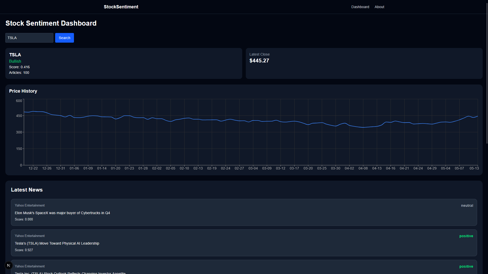

# Stock Sentiment Analysis
A full-stack application that analyzes stock market sentiment by combining news data with natural language processing. The application fetches recent news articles for a given stock ticker, analyzes their sentiment, and correlates it with historical stock prices.
## Demo

## Features
- Real-time stock news retrieval
- NLP-powered sentiment analysis using VADER
- Bullish / Bearish / Neutral sentiment classification
- Historical stock price visualization
- Interactive financial dashboard UI
- Article sentiment scoring
- External news article linking
- Full-stack microservice architecture
## Tech Stack
- **Next.js + TypeScript**
- **FastAPI (Python NLP service)**
- **NewsAPI + Alpha Vantage API** 
- **Recharts + Tailwind**

## Installation

### Prerequisites
- Node.js (v14+)
- Python (v3.8+)
- npm

### Setup
1. **Clone the repository**
2. **Install Node.js dependencies**
3. **Set up Python environment**
4. **Create environment file**